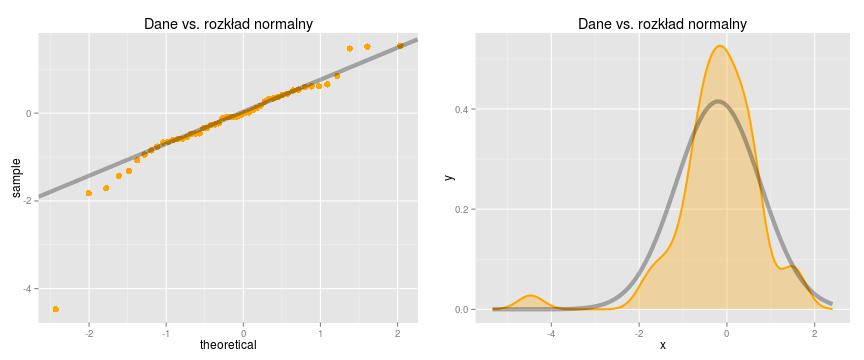
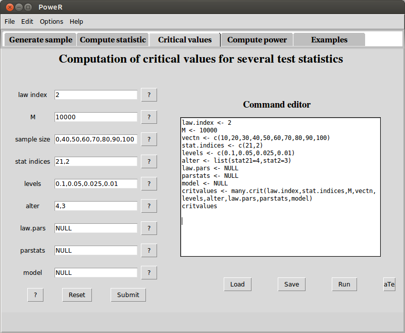
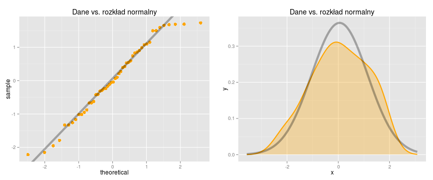
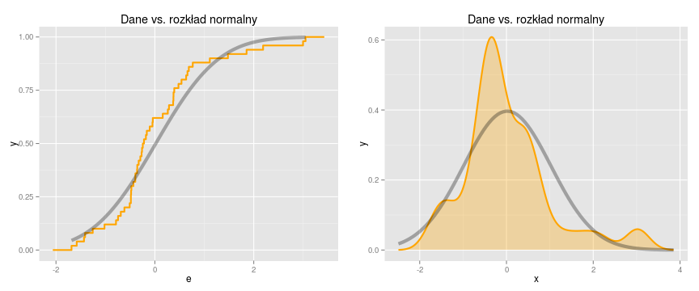
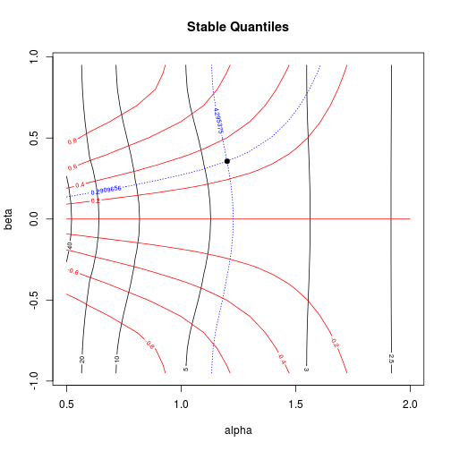
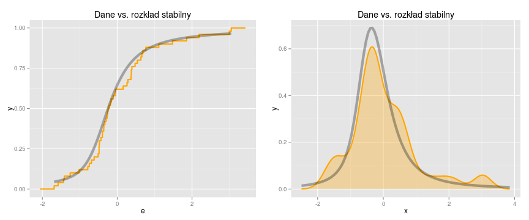
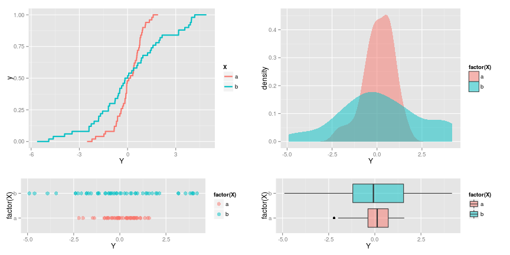

Porównanie jednej, dwóch i kilku zmiennych losowych 
========================================================
Wprowadzenie
-----------------

Prezentacja wybranych testów statystycznych badających zgodność z wybranym rozkładem prawdopodobieństwa będzie się opierać w głównej mierze na dwóch pakietach: *PoweR* oraz *EnvStats*. Pakiet *EnvStats* jest przeznaczony głównie dla osób wykonujących statystyczne analizy danych związane z ochroną środowiska. Zaznaczmy jednak że, wszystkie funkcje z tej biblioteki są przydatne dla każdego a więc nie tylko do analiz danych środowiskowych. Osoby zainteresowane możliwościami tego pakietu z pewnością zainteresuje książka *EnvStats. An R Package for Environmental Statistics - Steven P. Millard* która jest poświęcona w całości tej bibliotece.
Warto podkreślić że w tym dokumencie zostanie dokonany przegląd tylko kilku procedur dostępnych w tych pakietach tzn. testowanie zgodności z rozkładem normalnym, z wybranym rozkładem prawdopodobieństwa oraz porównywanie dystrybuant.
Dodatkowo to opracowanie zostało uzupełnione o kilka ciekawych metod które są dostępne w takich pakietach jak: *dbEmpLikeGOF*, *dbEmpLikeNorm* oraz *exptest* i *kSamples*. 

Testy dla jednej zmiennej
------------------
**Testowanie zgodności z rozkładem normalnym**

Środowisko R oferuje bardzo wiele różnych testów normalności. W tym opracowaniu zostaną przedstawione tylko te najbardziej popularne np. Shapiro-Wilka, $\chi^2$ Pearsona, Andersona-Darlinga oraz kilka bardzo ciekawych alternatywnych rozwiązań. W pierwszej kolejności zostanie przedstawiony test Shapiro-Wilka który jest najczęściej wykorzystywany do badania zgodności z rozkładem normalnym.


```r
# przykładowe dane:
set.seed(24)
s = rnorm(50, 0, 1)
# przygotowanie danych:
y = quantile(s, c(0.25, 0.75))
x = qnorm(c(0.25, 0.75), mean(s), sd(s))
slope = diff(y)/diff(x)
int = y[1L] - slope * x[1L]
library(ggplot2)
# wykres kwantylowy:
QQ1 = ggplot(NULL, aes(sample = s)) + stat_qq(distribution = qnorm, dparams = list(mean = mean(s), 
    sd = sd(s)), colour = "orange", size = 3) + geom_abline(slope = slope, intercept = int, 
    size = 2, alpha = 0.3) + labs(title = "Dane vs. rozkład normalny")
# wykres gęstości:
DE1 = ggplot(data = with(density(s), data.frame(x, y)), aes(x = x, y = y)) + 
    geom_line(size = 1, col = "orange") + geom_area(aes(x = x, y = y), fill = "orange", 
    alpha = 0.3) + stat_function(fun = dnorm, arg = list(mean = mean(s), sd = sd(s)), 
    col = "black", size = 2, alpha = 0.3) + theme(legend.position = "none") + 
    labs(title = "Dane vs. rozkład normalny")
```


```r
library(grid)
pushViewport(viewport(layout = grid.layout(1, 2)))
print(QQ1, vp = viewport(layout.pos.row = 1, layout.pos.col = 1))
print(DE1, vp = viewport(layout.pos.row = 1, layout.pos.col = 2))
```

 

$$H_{0}: \text{ rozkład normalny}$$
Test Shapiro-Wilk:

```r
shapiro.test(s)
```

```
## 
## 	Shapiro-Wilk normality test
## 
## data:  s
## W = 0.8752, p-value = 8.031e-05
```


Jak już wyżej wspomniano testów badających normalność rozkładu jest bardzo dużo. Kilka z nich jest zaimplementowanych w bibliotece *nortest*.

Test Pearsona:

```r
library(nortest)
pearson.test(s)
```

```
## 
## 	Pearson chi-square normality test
## 
## data:  s
## P = 12.8, p-value = 0.07713
```

Ciekawą alternatywą dla testu *nortest::ad.test* jest funkcja *qualityTools::adSim*. Dzięki niej możemy wyznaczyć wartość p-value z wykorzystaniem metody bootstrap. Jeśli dodamy opcję *b=NA* to p-value będzie obliczona bez wykorzystania symulacji. 

```r
library(qualityTools)
adSim(s, distribution = "normal", b = NA)
```

```
## $distribution
## [1] "normal"
## 
## $parameter_estimation
##    mean      sd 
## -0.1979  0.9605 
## 
## $Anderson_Darling
## [1] 1.131
## 
## $p_value
## [1] 0.005296
```

```r
adSim(s, distribution = "normal", b = 10000)
```

```
## 
##     ... simulating the Anderson-Darling distribution by 10000 bootstraps for normal distribution... 
##  
## $distribution
## [1] "normal"
## 
## $parameter_estimation
##    mean      sd 
## -0.1979  0.9605 
## 
## $Anderson_Darling
## [1] 1.131
## 
## $p_value
## [1] 0.0051
```

Warto  pamiętać, że funkcja adSim może badać zgodność z takimi rozkładami jak: "cauchy", "exponential", "gumbel", "gamma", "log-normal", "lognormal", "logistic" oraz "weibull". 

Ponieważ testy mają różną skuteczność w badaniu odstępstw od normalności warto porównać ich moc.

Moc testu Shapiro-Wilka.

```r
mocSW = replicate(10000, shapiro.test(sample(s, 50, T))$p.value)
mean(mocSW < 0.05)
```

```
## [1] 0.7308
```

Moc testu Pearsona.

```r
mocP = replicate(10000, pearson.test(sample(s, 50, T))$p.value)
mean(mocP < 0.05)
```

```
## [1] 0.6123
```

Moc testu Andersona-Darlinga.

```r
mocAD = replicate(10000, ad.test(sample(s, 50, T))$p.value)
mean(mocAD < 0.05)
```

```
## [1] 0.7294
```


Osoby zainteresowane tematem przydatności niektórych testów normalności dla pewnych alternatyw z pewnością zainteresuje dokument: [Przemysław Biecek, Wybrane testy normalności, 2013. Materiały Fundacji SmarterPoland.pl](http://smarterpoland.pl/index.php/2013/04/wybrane-testy-normalnoci/).


Na szczególną uwagę zasługuje pakiet *PoweR* w którym znajdziemy ponad czterdzieści wybranych testów normalności. Każdy z nich jest przypisany do odpowiedniej liczby  np. test Shapiro-Wilka ma numer 21.
Lista wszystkich testów normalności jest dostępna w pliku pomocy którą można wywołać poleceniem: *?Normality.tests*.

```r
library(PoweR)
```

```
## Loading required package: parallel
```

```r
getindex(, 21)
```

```
##    Index Stat Alter Nbparams
## 21    21    W     4        0
```


Test Shapiro-Wilka.

```r
statcompute(21, s)
```

```
## $statistic
## [1] 0.8752
## 
## $pvalue
## [1] 8.031e-05
## 
## $decision
## [1] 1 1
## 
## $alter
## [1] 4
## 
## $stat.pars
## [1] NA
```

Wyznaczymy teraz wartość p-value za pomocą symulacji Monte Carlo.

```r
pvalueMC(s, stat.index = 21, null.law.index = 2, M = 10^4, alter = 4)
```

```
## [1] 2e-04
```

Zaznaczmy, że opcja *null.law.index* oznacza funkcję prawdopodobieństwa. Pod numerem 2 znajduje się rozkład normalny o parametrach $\mu=0$ oraz $\sigma=1$.

```r
getindex(2)
```

```
##   Index              Law Nbparams Default1 Default2 Default3 Default4
## 2     2 Normal(mu,sigma)        2        0        1       NA       NA
```

W przypadku zmiany domyślnie ustawionych wartości parametrów $\mu$ i $\sigma$ na $\mu=2$ oraz $\sigma=3$ należy dodać opcję *null.law.pars=c(mu=2,sigma=3)*.

Warto również wspomnieć o funkcji *gensample* dzięki której możemy wygenerować zmienne losowe z określonego rozkładu.

```r
set.seed(24)
e <- gensample(2, 50, law.pars = c(0, 1))$sample
```


Ciekawą opcją jest także możliwość wygenerowania wartości krytycznych z wykorzystaniem symulacji Monte Carlo. Poniżej przykład dla testu Shapiro-Wilka.

Wartości krytyczne dla $n=50$ oraz $\alpha=0.1$, $\alpha=0.05$, $\alpha=0.025$ i $\alpha=0.01$.

```r
compquant(n = 50, probs = c(0.1, 0.05, 0.025, 0.01), law.index = 2, stat.index = 21, 
    M = 10^5)$quant
```

```
##    10%     5%   2.5%     1% 
## 0.9612 0.9540 0.9467 0.9368
```

Przykładowa tablica wartości krytycznych dla testu Shapiro-Wilka oraz testu Andersona-Darlinga dla $n=10,20...,100$ oraz  $\alpha=0.1$, $\alpha=0.05$, $\alpha=0.025$ i $\alpha=0.01$

```r
tableSW_AD <- many.crit(law.index = 2, stat.indices = c(21, 2), M = 10^5, vectn = seq(10, 
    100, 10), level = c(0.1, 0.05, 0.025, 0.01), alter = list(stat21 = 4, stat2 = 3), 
    law.pars = NULL, parstats = NULL)
tableSW_AD
```

```
##      n level critL.stat21 critR.stat2
## 1   10 0.100       0.8702      0.5784
## 2   20 0.100       0.9203      0.6073
## 3   30 0.100       0.9413      0.6144
## 4   40 0.100       0.9534      0.6186
## 5   50 0.100       0.9612      0.6222
## 6   60 0.100       0.9667      0.6216
## 7   70 0.100       0.9708      0.6239
## 8   80 0.100       0.9739      0.6265
## 9   90 0.100       0.9765      0.6248
## 10 100 0.100       0.9786      0.6268
## 11  10 0.050       0.8443      0.6862
## 12  20 0.050       0.9044      0.7205
## 13  30 0.050       0.9298      0.7368
## 14  40 0.050       0.9445      0.7376
## 15  50 0.050       0.9539      0.7372
## 16  60 0.050       0.9605      0.7443
## 17  70 0.050       0.9654      0.7466
## 18  80 0.050       0.9692      0.7445
## 19  90 0.050       0.9721      0.7465
## 20 100 0.050       0.9748      0.7468
## 21  10 0.025       0.8199      0.7930
## 22  20 0.025       0.8875      0.8398
## 23  30 0.025       0.9184      0.8517
## 24  40 0.025       0.9359      0.8538
## 25  50 0.025       0.9469      0.8575
## 26  60 0.025       0.9546      0.8586
## 27  70 0.025       0.9601      0.8662
## 28  80 0.025       0.9645      0.8620
## 29  90 0.025       0.9677      0.8663
## 30 100 0.025       0.9707      0.8681
## 31  10 0.010       0.7854      0.9387
## 32  20 0.010       0.8670      0.9950
## 33  30 0.010       0.9029      1.0030
## 34  40 0.010       0.9231      1.0226
## 35  50 0.010       0.9363      1.0220
## 36  60 0.010       0.9453      1.0177
## 37  70 0.010       0.9522      1.0344
## 38  80 0.010       0.9574      1.0264
## 39  90 0.010       0.9621      1.0241
## 40 100 0.010       0.9657      1.0363
```

Osoby składające swoje dokumenty w systemie LaTeX na pewno zinteresuje opcja za pomocą której można wygenerować kod powyższej tabeli dla systemu LaTeX.

```r
print(tableSW_AD, digits = 3, latex.output = TRUE)
```

Należy również zaznaczyć, że mamy możliwość wywołać graficzny interfejs użytkownika wpisując polecenie *power.gui()*. Poniżej przykład wygenerowania tabeli wartości krytycznych *tableSW_AD* ale z wykorzystaniem interfejsu graficznego -- zakładka **Critical values**.
```
power.gui()
```



Warto zaznaczyć, że do uruchomienia GUI wymagana jest instalacja dodatku *iwidgets4*. Dla użytkowników Linuksa np. dystrybucji Ubuntu  sprawa jest bardzo prosta wystarczy wpisać w konsoli poleceń: *sudo apt-get install iwidgets4*.


Jest to tylko część możliwości tego pakietu.
Więcej informacji można znaleźć w dokumencie [Le progiciel PoweR : un outil de recherche reproductible pour faciliter les calculs de puissance de certains tests d’hypothèses au moyen de simulations de Monte Carlo](https://papyrus.bib.umontreal.ca/xmlui/bitstream/handle/1866/9922/Tran_Viet_Anh_2013_memoire.pdf;jsessionid=0E7E817594ADC045112B3303E09194C5?sequence=2). Warto także zapoznać się z informacjami zawartymi na stronie: http://siod.tdt.edu.vn/Proceedings/rLafayes%28258%29.htm.

Gdy badamy normalność zmiennej warto zwracać uwagę także na ciekawe alternatywy dla klasycznych testów normalności.

```r
library(SuppDists)
set.seed(2)
w <- rJohnson(50, JohnsonFit(t = c(0, 1, -0.2, 2.2), moment = "use"))
# przygotowanie danych:
y = quantile(w, c(0.25, 0.75))
x = qnorm(c(0.25, 0.75), mean(w), sd(w))
slope = diff(y)/diff(x)
int = y[1L] - slope * x[1L]
# wykres kwantylowy:
QQ2 = ggplot(NULL, aes(sample = w)) + stat_qq(distribution = qnorm, dparams = list(mean = mean(w), 
    sd = sd(w)), colour = "orange", size = 3) + geom_abline(slope = slope, intercept = int, 
    size = 2, alpha = 0.3) + labs(title = "Dane vs. rozkład normalny")
# wykres gęstości:
DE2 = ggplot(data = with(density(w), data.frame(x, y)), aes(x = x, y = y)) + 
    geom_line(size = 1, col = "orange") + geom_area(aes(x = x, y = y), fill = "orange", 
    alpha = 0.3) + stat_function(fun = dnorm, arg = list(mean = mean(w), sd = sd(w)), 
    col = "black", size = 2, alpha = 0.3) + theme(legend.position = "none") + 
    labs(title = "Dane vs. rozkład normalny")
```


```r
pushViewport(viewport(layout = grid.layout(1, 2)))
print(QQ2, vp = viewport(layout.pos.row = 1, layout.pos.col = 1))
print(DE2, vp = viewport(layout.pos.row = 1, layout.pos.col = 2))
```

 

$$H_{0}: \text{ rozkład normalny}$$

```r
library(dbEmpLikeGOF)
dbEmpLikeGOF(w, testcall = "normal")
```

```
## 
## ...Working on teststat 
## estimating pvalue based on table
```

```
## $teststat
## [1] 12.53
## 
## $pvalue
## [1] 0.01012
```


```r
pearson.test(w)
```

```
## 
## 	Pearson chi-square normality test
## 
## data:  w
## P = 5.6, p-value = 0.5872
```


```r
shapiro.test(w)
```

```
## 
## 	Shapiro-Wilk normality test
## 
## data:  w
## W = 0.9658, p-value = 0.1558
```

Warto prześledzić wyniki symulacji dotyczące mocy poszczególnych testów.
```
MOCdb <- replicate(10000, dbEmpLikeGOF(sample(w, 50, T), testcall = "normal" )$pvalue)
mean(MOCdb < 0.05)
```
```
## [1] 0.8421
```
```
MOCsw <- replicate(10000, pearson.test(sample(w, 50, T))$p.value)
mean(MOCsw < 0.05)
```
```
## [1] 0.2388
```
```
MOCsw <- replicate(10000, shapiro.test(sample(w, 50, T))$p.value)
mean(MOCsw < 0.05)
```
```
## [1] 0.5427
```

Podobnie jak w przypadku testów normalności są też całe zestawy testów przeznaczonych do badania konkretnego rozkładu prawdopodobieństwa. Do badania zgodności z rozkładem Laplace możemy wykorzystać szereg testów zaimplementowanych we wcześniej już omawianym pakiecie *PoweR*. Testy te są przypisane do indeksów od 42 do 60.
Natomiast testy o indeksach od 63 do 82 służą do badania zgodności z rozkładem jednostajnym. Więcej informacji możemy uzyskać edytując plik pomocy dla wybranej rodziny testów: *?Laplace.tests* lub *?Uniformity.tests*. Zwróćmy uwagę, że funkcja *dbEmpLikeGOF::dbEmpLikeGOF* także może być wykorzystana do testowania zgodności z rozkładem jednostajnym. Z kolei szeroki wybór testów dla rozkładu wykładniczego jest dostępny w pakiecie *exptest*. Poniżej kilka przykładów.


```r
set.seed(28)
g = rgamma(50, 1, 3)
```

$$H_{0}: \text{ rozkład wykładniczy}$$

```r
library(exptest)
ep.exp.test(g)
```

```
## 
## 	The test for exponentiality of Epps and Pulley
## 
## data:  g
## EPn = 1.876, p-value = 0.06062
```

```r
shapiro.exp.test(g)
```

```
## 
## 	Shapiro-Wilk test for exponentiality
## 
## data:  g
## W = 0.0145, p-value = 0.0705
```

```r
ks.exp.test(g)
```

```
## 
## 	Kolmogorov-Smirnov test for exponentiality
## 
## data:  g
## KSn = 0.1475, p-value = 0.058
```

Zwróćmy uwagę na to że, wartość p-value dla testów: Shapiro-Wilka oraz Kołmogorowa jest zawsze wyznaczona za pomocą symulacji Monte Carlo. Natomiast w teście Eppsa- Pulleya możemy sami zdecydować w jaki sposób wyznaczyć p-value. W domyślnych ustawieniach symulacja Monte Carlo dla tego testu jest wyłączona. 


**Testowanie zgodności z dowolnym rozkładem**

Bardzo często zdarza się że, chcemy testować zgodność z dowolnie wybranym rozkładem prawdopodobieństwa.
W takich przypadkach są używane bardziej uniwersalne testy. W literaturze najczęściej jest proponowany test Kołmogorowa lub $\chi^2$ Pearsona, rzadziej Andersona-Darlinga. Poniżej zostaną zaprezentowane wybrane procedury które są dostępne w bibliotece *EnvStats*.


```r
set.seed(224)
e = rnorm(50, 0, 1)
# wykres dystrybuanty:
QQ3 = ggplot(NULL, aes(e)) + stat_ecdf(col = "orange", size = 1) + stat_function(fun = pnorm, 
    arg = list(mean = mean(e), sd = sd(e)), aes(), size = 2, alpha = 0.3, col = "black") + 
    theme(legend.position = "none") + labs(title = "Dane vs. rozkład normalny")
# wykres gęstości:
DE3 = ggplot(data = with(density(e), data.frame(x, y)), aes(x = x, y = y)) + 
    geom_line(size = 1, col = "orange") + geom_area(aes(x = x, y = y), fill = "orange", 
    alpha = 0.3) + stat_function(fun = dnorm, arg = list(mean = mean(e), sd = sd(e)), 
    col = "black", size = 2, alpha = 0.3) + theme(legend.position = "none") + 
    labs(title = "Dane vs. rozkład normalny")
```


```r
pushViewport(viewport(layout = grid.layout(1, 2)))
print(QQ3, vp = viewport(layout.pos.row = 1, layout.pos.col = 1))
print(DE3, vp = viewport(layout.pos.row = 1, layout.pos.col = 2))
```

 


```r
library(EnvStats)
```

```
## 
## Attaching package: 'EnvStats'
## 
## Następujący obiekt został zakryty from 'package:qualityTools':
## 
##     dlnorm3, plnorm3, qlnorm3, qqPlot
## 
## Następujący obiekt został zakryty from 'package:stats':
## 
##     predict.lm
```

```r
gofTest(e, test = "sw", distribution = "norm")
```

```
## 
## Results of Goodness-of-Fit Test
## -------------------------------
## 
## Test Method:                     Shapiro-Wilk GOF
## 
## Hypothesized Distribution:       Normal
## 
## Estimated Parameter(s):          mean = 0.01812
##                                  sd   = 1.00564
## 
## Estimation Method:               mvue
## 
## Data:                            e
## 
## Sample Size:                     50
## 
## Test Statistic:                  W = 0.9061
## 
## Test Statistic Parameter:        n = 50
## 
## P-value:                         0.0007713
## 
## Alternative Hypothesis:          True cdf does not equal the
##                                  Normal Distribution.
```

Zaznaczmy, że dystrybuanta rozkładu normalnego jest ustawieniem domyślnym.
Listę wszystkich dystrybuant jakie są dostępne dla funkcji *EnvStats::gofTest* możemy edytować za pomocą polecenia *?Distribution.df*. Poniżej przykład testu zgodności Shapiro-Wilka dla uogólnionego rozkładu wartości ekstremalnych. Na początek oszacujemy parametry rozpatrywanego rozkladu.

```r
egevd(e, method = "mle", ci = TRUE, conf.level = 0.95)
```

```
## 
## Results of Distribution Parameter Estimation
## --------------------------------------------
## 
## Assumed Distribution:            Generalized Extreme Value
## 
## Estimated Parameter(s):          location = -0.41493
##                                  scale    =  0.79646
##                                  shape    =  0.03012
## 
## Estimation Method:               mle
## 
## Data:                            e
## 
## Sample Size:                     50
## 
## Confidence Interval for:         location
## 
## Confidence Interval Method:      Normal Approximation
##                                  (t Distribution) based on
##                                  observed information
## 
## Confidence Interval Type:        two-sided
## 
## Confidence Level:                95%
## 
## Confidence Interval:             LCL = -0.6523
##                                  UCL = -0.1775
```

Następnie wykonamy dwa wykresy diagnostyczne.

```r
# wykres dystrybuanty:
QQ4 = ggplot(NULL, aes(e)) + stat_ecdf(col = "orange", size = 1) + stat_function(fun = pgevd, 
    arg = list(location = -0.41493, scale = 0.79646, shape = 0.03012), aes(), 
    size = 2, alpha = 0.3, col = "black") + theme(legend.position = "none") + 
    labs(title = "Dane vs. rozkład wartości ekstremalnych")
# wykres gęstości:
DE4 = ggplot(data = with(density(e), data.frame(x, y)), aes(x = x, y = y)) + 
    geom_line(size = 1, col = "orange") + geom_area(aes(x = x, y = y), fill = "orange", 
    alpha = 0.3) + stat_function(fun = dgevd, arg = list(location = -0.41493, 
    scale = 0.79646, shape = 0.03012), col = "black", size = 2, alpha = 0.3) + 
    theme(legend.position = "none") + labs(title = "Dane vs. rozkład wartości ekstremalnych")
```


```r
pushViewport(viewport(layout = grid.layout(1, 2)))
print(QQ4, vp = viewport(layout.pos.row = 1, layout.pos.col = 1))
print(DE4, vp = viewport(layout.pos.row = 1, layout.pos.col = 2))
```

 

Test zgodności Shapiro-Wilka z uogólnionym rozkładem wartości ekstremalnych.

```r
gofTest(e, test = "sw", distribution = "gevd")
```

```
## 
## Results of Goodness-of-Fit Test
## -------------------------------
## 
## Test Method:                     Shapiro-Wilk GOF Based on Chen & Balakrisnan (1995)
## 
## Hypothesized Distribution:       Generalized Extreme Value
## 
## Estimated Parameter(s):          location = -0.41493
##                                  scale    =  0.79646
##                                  shape    =  0.03012
## 
## Estimation Method:               mle
## 
## Data:                            e
## 
## Sample Size:                     50
## 
## Test Statistic:                  W = 0.9648
## 
## Test Statistic Parameter:        n = 50
## 
## P-value:                         0.1405
## 
## Alternative Hypothesis:          True cdf does not equal the
##                                  Generalized Extreme Value Distribution.
```

Jeśli interesuje nas dystrybuanta która jest dostępna w innej bibliotece np. rozkład stabilny powinniśmy skorzystać np. z testu zgodności Andersona-Darlinga *ADGofTest::ad.test*. Nie ma on żadnych ograniczeń co do wyboru dystrybuanty. Można także zastosować test zgodności Kołmogorowa *stats::ks.test* jednak w pewnych sytuacjach lepiej skorzystać z tego pierwszego testu.

Oszacowanie parametrów rozkładu stabilnego:

```r
library(stabledist)
library(fBasics)
```

```
## Loading required package: MASS
## 
## Attaching package: 'MASS'
## 
## Następujący obiekt został zakryty from 'package:EnvStats':
## 
##     boxcox
## 
## Loading required package: timeDate
## 
## Attaching package: 'timeDate'
## 
## Następujący obiekt został zakryty from 'package:EnvStats':
## 
##     kurtosis, skewness
## 
## Loading required package: timeSeries
## 
## Attaching package: 'fBasics'
## 
## Następujący obiekt został zakryty from 'package:base':
## 
##     norm
```

```r
stableFit(e, doplot = T)
```

 

```
## 
## Title:
##  Stable Parameter Estimation 
## 
## Call:
##  .qStableFit(x = x, doplot = doplot, title = title, description = description)
## 
## Model:
##  Stable Distribution
## 
## Estimated Parameter(s):
##   alpha    beta   gamma   delta 
##  1.2010  0.3570  0.4286 -0.3007 
## 
## Description:
##  Sat Mar  8 09:39:49 2014 by user:
```

Wykresy diagnostyczne.

```r
# wykres dystrybuanty:
QQ5 = ggplot(NULL, aes(e)) + stat_ecdf(col = "orange", size = 1) + stat_function(fun = pstable, 
    arg = list(alpha = 1.201, beta = 0.357, gamma = 0.4286, delta = -0.3007), 
    aes(), size = 2, alpha = 0.3, col = "black") + theme(legend.position = "none") + 
    labs(title = "Dane vs. rozkład stabilny")
# wykres gęstości:
DE5 = ggplot(data = with(density(e), data.frame(x, y)), aes(x = x, y = y)) + 
    geom_line(size = 1, col = "orange") + geom_area(aes(x = x, y = y), fill = "orange", 
    alpha = 0.3) + stat_function(fun = dstable, arg = list(alpha = 1.201, beta = 0.357, 
    gamma = 0.4286, delta = -0.3007), col = "black", size = 2, alpha = 0.3) + 
    theme(legend.position = "none") + labs(title = "Dane vs. rozkład stabilny")
```


```r
pushViewport(viewport(layout = grid.layout(1, 2)))
print(QQ5, vp = viewport(layout.pos.row = 1, layout.pos.col = 1))
print(DE5, vp = viewport(layout.pos.row = 1, layout.pos.col = 2))
```

 

Test zgodności Andersona-Darlinga z rozkładem stabilnym:

```r
library("ADGofTest")
```

```
## 
## Attaching package: 'ADGofTest'
## 
## Następujący obiekt został zakryty from 'package:nortest':
## 
##     ad.test
```

```r
ad.test(e, pstable, alpha = 1.201, beta = 0.357, gamma = 0.4286, delta = -0.3007)
```

```
## 
## Results of Hypothesis Test
## --------------------------
## 
## Alternative Hypothesis:          NA
## 
## Test Name:                       Anderson-Darling GoF Test
## 
## Data:                            e  and  pstable
## 
## Test Statistic:                  AD = 0.715
## 
## P-value:                         0.5457
```

Sprawdźmy jeszcze jaki wynik uzyskamy dla rozkładu wartości ekstremalnych.

```r
ad.test(e, pgevd, location = -0.41493, scale = 0.79646, shape = 0.03012)
```

```
## 
## Results of Hypothesis Test
## --------------------------
## 
## Alternative Hypothesis:          NA
## 
## Test Name:                       Anderson-Darling GoF Test
## 
## Data:                            e  and  pgevd
## 
## Test Statistic:                  AD = 0.7267
## 
## P-value:                         0.5362
```


Testy dla dwóch zmiennych
---------------
**Porównanie dystrybuant**

W tej części tego opracowania
zostaną przedstawione alternatywne rozwiązania dla testu Kołmogorowa-Smirnowa *stats::ks.test*. Jednym z nich jest bardzo interesująca funkcja *kSamples::ad.test* która umożliwia ocenę czy lista zmiennych pochodzi z tej samej populacji.
Podobne zastosowanie ma funkcja *dbEmpLikeGOF* z pakietu o tej samej nazwie.


```r
set.seed(1)
a = rnorm(50, 0, 1)
set.seed(2)
b = rnorm(50, 0, 2)
Y = c(a, b)
X = rep(letters[1:2], each = 50)
D2 = data.frame(Y, X)
```


```r
ECDF2 = ggplot(D2, aes(Y, colour = X)) + stat_ecdf(size = 1)
DEN2 = ggplot(D2, aes(x = Y, fill = factor(X))) + geom_density(alpha = 0.5, 
    size = 0)
BOX2 = ggplot(D2, aes(x = factor(X), y = Y, fill = factor(X))) + geom_boxplot(alpha = 0.5, 
    size = 0.5) + coord_flip()
POIN2 = ggplot(D2, aes(x = factor(X), y = Y, colour = factor(X))) + geom_point(alpha = 0.5, 
    size = 3) + coord_flip()
```


```r
pushViewport(viewport(layout = grid.layout(3, 2)))
print(ECDF2, vp = viewport(layout.pos.row = 1:2, layout.pos.col = 1))
print(DEN2, vp = viewport(layout.pos.row = 1:2, layout.pos.col = 2))
print(POIN2, vp = viewport(layout.pos.row = 3, layout.pos.col = 1))
print(BOX2, vp = viewport(layout.pos.row = 3, layout.pos.col = 2))
```

 

Sprawdźmy jaki wynik otrzymamy w teście Kołmogorowa-Smirnowa.
$$H_{0}: \text{ takie same dystrybuanty}$$

```r
ks.test(a, b)
```

```
## 
## Results of Hypothesis Test
## --------------------------
## 
## Alternative Hypothesis:          two-sided
## 
## Test Name:                       Two-sample Kolmogorov-Smirnov test
## 
## Data:                            a and b
## 
## Test Statistic:                  D = 0.26
## 
## P-value:                         0.06779
```

Jak można zauważyć test Kołmogorowa-Smirnowa nie odrzucił hipotezy zerowej (równe dystrybuanty) dla $\alpha=0.05$. Teraz sprawdzimy jakie wyniki uzyskamy po zastosowaniu dwóch alternatywnych rozwiązań.

```r
dbEmpLikeGOF(a, b)
```

```
## 
## ...Working on teststat 
## estimating pvalue based on table
```

```
## $teststat
## [1] 27.25
## 
## $pvalue
## [1] 0.001
```

```r
library(kSamples)
```

```
## 
## Attaching package: 'kSamples'
## 
## Następujący obiekt został zakryty from 'package:ADGofTest':
## 
##     ad.test
## 
## Następujący obiekt został zakryty from 'package:nortest':
## 
##     ad.test
```

```r
ad.test(list(a, b), method = "simulated", Nsim = 10000)
```

```
## 
## 
##  Anderson-Darling k-sample test.
## 
## Number of samples:  2
## Sample sizes:  50, 50
## Number of ties: 0
## 
## Mean of  Anderson-Darling  Criterion: 1
## Standard deviation of  Anderson-Darling  Criterion: 0.74725
## 
## T.AD = ( Anderson-Darling  Criterion - mean)/sigma
## 
## Null Hypothesis: All samples come from a common population.
## 
## Based on Nsim = 10000 simulations
## 
##               AD  T.AD  asympt. P-value  sim. P-value
## version 1: 4.378 4.521         0.005375        0.0048
## version 2: 4.440 4.599         0.005037        0.0044
```

Dwie alternatywne procedury dla testu Kołmogorowa-Smirnowa hipotezę zerową odrzuciły. Można więc sądzić, że zmienne pochodzą z różnych populacji. Dodajmy że, funkcja *kSamples::ad.test* może badać hipotezę zerową nie tylko dla dwóch zmiennych ale rówież wtedy gdy jest ich więcej.

**Testowanie zgodności z rozkładem normalnym**

Pomimo tego iż dwie analizowane zmienne nie pochodzą z tej samej populacji to możemy być zainteresowani odpowiedzią na pytanie czy mają ten sam rozkład np. normalny. Warto podkreślić, że zmienne mogą pochodzić z tego samego rozkładu np. normalnego ale mogą mieć np. różne średnie, wariancje. W analizowanym przypadku różnią się wariancjami. Te parametry mają wpływ na kształt funkcji prawdopodobieństwa i dystrybuanty.
$$H_{0}: \text{ zmienne mają rozkład normalny}$$

```r
gofGroupTest(list(a, b), test = "sw", distribution = "norm")
```

```
## 
## Results of Group Goodness-of-Fit Test
## -------------------------------------
## 
## Test Method:                     Wilk-Shapiro GOF (Normal Scores)
## 
## Hypothesized Distribution:       Normal
## 
## Data:                            list(a, b)
## 
## Grouping Variable:               Components
## 
## Number of Groups:                2
## 
## Sample Sizes:                    Component.1 = 50
##                                  Component.2 = 50
## 
## Test Statistic:                  z (G) = -0.9602
## 
## P-values for
## Individual Tests:                Component.1 = 0.1306
##                                  Component.2 = 0.4073
## 
## P-value for
## Group Test:                      0.1685
## 
## Alternative Hypothesis:          At least one group
##                                  does not come from a
##                                  Normal Distribution.
```

```r
library(dbEmpLikeNorm)
dbELnorm(list(a, b))
```

```
## 
## ...Working on teststat 
## estimating pvalue based on table 
## Tables based on sets of equal sample size 
##     Continuing with sample size of first element in list
```

```
## $teststat
## [1] 16.34
## 
## $pvalue
## [1] 0.1202
```

Na zakończenie dodajmy, że lista może zawierać kilka zmiennych.


