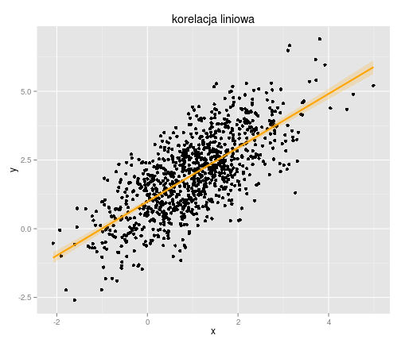
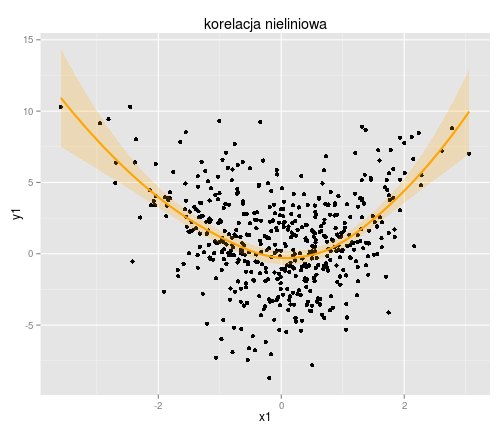

Testy korelacji
========================================================

Test korelacji liniowej Pearsona [1895] to jeden z bardziej znanych testów statystycznych badających zależność dwóch zmiennych losowych o rozkładzie normalnym. 
W przypadku naruszenia założenia normalności (np. występowanie obserwacji odstających) zwykle stosuje się nieparametryczny test korelacji rang Spearmana [1904].
Poniżej przykład korelacij liniowej dwóch zmiennych.

```r
set.seed(1256)
x <- rnorm(1000, 1, 1)
set.seed(3654)
y <- x + rnorm(1000, 1, 1)
d <- data.frame(x, y)
```


```r
library(ggplot2)
ggplot(d, aes(x, y)) + geom_point() + stat_smooth(method = lm, col = "orange", 
    size = 1, fill = "orange", alpha = 0.2) + ggtitle("korelacja liniowa")
```

 

Normalność rozkładu

```r
shapiro.test(x)
```

```

	Shapiro-Wilk normality test

data:  x
W = 0.9979, p-value = 0.2364
```

```r
shapiro.test(y)
```

```

	Shapiro-Wilk normality test

data:  y
W = 0.9989, p-value = 0.822
```


```r
cor.test(x, y, method = "pearson")
```

```

	Pearson's product-moment correlation

data:  x and y
t = 31.79, df = 998, p-value < 2.2e-16
alternative hypothesis: true correlation is not equal to 0
95 percent confidence interval:
 0.6772 0.7389
sample estimates:
   cor 
0.7094 
```


```r
cor.test(x, y, method = "spearman")
```

```

	Spearman's rank correlation rho

data:  x and y
S = 51761140, p-value < 2.2e-16
alternative hypothesis: true rho is not equal to 0
sample estimates:
   rho 
0.6894 
```

Oszacowany współczynnik korelacji liniowej Pearsona wynosi $\rho_{Pearson}=0.7094$ i jest istotny statystycznie ponieważ $p-value=2.2e-16$. Wniosek ten potwierdza także test nieparametryczny Spearmana $\rho_{Spearman}=0.6894$ i $p-value=2.2e-16$.

Jeśli liczebość obserwacji jest mała warto zwrócić uwagę na permutacyjny test korelacji Pearsona *perm.cor.test*
z pakietu *RVAideMemoire*.

Z kolei gdy w zbiorze danych występują obserwacje odstające można skorzystać z testu korelacji Pearsona dla zmiennych poddanych procesowi winsoryzacji.


```r
library(PairedData)
winsor.cor.test(x, y, tr = 0.2)
```

```

	winsorized correlation, trim=0.2

data:  x and y
t = 26.9, df = 598, p-value < 2.2e-16
alternative hypothesis: true (winsorized) correlation is not equal to 0
sample estimates:
   cor 
0.6484 
```

Inne ciekawe rozwiązanie to  Gaussian rank correlation test.

```r
library(rococo)
gauss.cor.test(x, y)
```

```

	Gaussian rank correlation estimator

data:  x and y
t = 31.76, df = 998, p-value < 2.2e-16
alternative hypothesis: true correlation is not equal to 0
95 percent confidence interval:
 0.6768 0.7386
sample estimates:
  cor 
0.709 
```

W przestawionej powyżej bibliotece *rococo* jest jeszcze kilka innych metod badania korelacji. 
Szczególy tego pakietu są omówione w dokumencie 
**An R Package Implementing a Robust Rank Correlation Coefficient and a Corresponding Test**,
 *Ulrich Bodenhofer and Martin Krone* który jest dołączony do dokumentacji tego pakietu.
Także w artykule **The Gaussian Rank Correlation Estimator: Robustness Properties**, *Kris Boudt, Jonathan Cornelissen, Christophe Croux* można znaleźć wiele ciekawych informacji na temat tego testu. Jest on dostępny po adresem: http://papers.ssrn.com/sol3/papers.cfm?abstract_id=1689465


Należy w tym miejscu podkreślić, że współczynnik Pearsona jest miarą
liniowej zależności. Oznacza to, że w przypadku dowolnego nieliniowego związku, stosowanie testu korelacji Pearsona może prowadzić do błędnych wniosków.


```r
set.seed(1252)
x1 <- rnorm(500, 0, 1)
set.seed(332)
y1 <- x1^2 + rnorm(500, 0, 3)
d1 <- data.frame(x1, y1)
```


```r
ggplot(d1, aes(x1, y1)) + geom_point() + stat_smooth(method = loess, col = "orange", 
    size = 1, fill = "orange", alpha = 0.2) + ggtitle("korelacja nieliniowa")
```

 


```r
# normalność rozkładu:
shapiro.test(x1)
```

```
## 
## 	Shapiro-Wilk normality test
## 
## data:  x1
## W = 0.9975, p-value = 0.665
```

```r
# normalność rozkładu:
shapiro.test(y1)
```

```
## 
## 	Shapiro-Wilk normality test
## 
## data:  y1
## W = 0.9963, p-value = 0.296
```


```r
# test korelacji Pearsona:
cor.test(x1, y1, method = "pearson")
```

```

	Pearson's product-moment correlation

data:  x1 and y1
t = -0.8084, df = 498, p-value = 0.4193
alternative hypothesis: true correlation is not equal to 0
95 percent confidence interval:
 -0.12350  0.05165
sample estimates:
    cor 
-0.0362 
```


Zatem oprócz testu Pearsona warto stosować 
także inne metody które służą do badania korelacji liniowej oraz nieliniowej. Poniżej kilka przykładów takich statystyk dostępnych w środowisku R:

* distance correlation:

```r
library(energy)
dcor.ttest(x1, y1)
```

```
## 
## 	dcor t-test of independence
## 
## data:  x1 and y1
## T = 18.41, df = 124249, p-value < 2.2e-16
## sample estimates:
## Bias corrected dcor 
##             0.05216
```

Parametr korelacji należy do przedziału $<0;1>$. Dla $0$ brak zależności.

* Heller-Heller-Gorfine Tests:

```r
library(HHG)
X <- rbind(x1, y1)
Dx <- as.matrix(dist((X[1, ]), diag = TRUE, upper = TRUE))
Dy <- as.matrix(dist((X[2, ]), diag = TRUE, upper = TRUE))
hhg.test(Dx, Dy, nr.perm = 1000)
```

```
## $sum.chisq
## [1] 2101226
## 
## $sum.lr
## [1] 966293
## 
## $max.chisq
## [1] 107.8
## 
## $max.lr
## [1] 42.87
## 
## $perm.pval.hhg.sc
## [1] 0.000997
## 
## $perm.pval.hhg.sl
## [1] 0.000997
## 
## $perm.pval.hhg.mc
## [1] 0.000997
## 
## $perm.pval.hhg.ml
## [1] 0.000997
## 
## $extras.edist
## [1] NA
## 
## $extras.ht
## [1] 0
## 
## $extras.perm.pval.edist
## [1] NA
## 
## $extras.perm.pval.ht
## [1] 1
## 
## $extras.hhg.tbls
## NULL
## 
## $extras.perm.stats
## NULL
```


Do badania relacji pomiędzy jednowymiarowymi zmiennymi z dużych zbiorów danych (z takimi danymi mamy coraz częściej do czynienia w takich dziedzinach jak fizyka, biologia, ekonomia) statystyka Hoeffding's D oraz współczynnik MIC może być również ciekawą propozycją.
* Maximal Information Coefficient:

```r
library(minerva)
mine(x1, y1, n.cores = 2)$MIC
```

```
## [1] 0.2308
```

MIC to wskaźnik który informuje nas o tym jak bardzo dwie zmienne są skorelowane.
Wyniki wahają się od 0 (nieskorelowane) do 1 (wysokie korelacje).
Warto zauważyć, że wskaźnik MIC ma wartość porównywalną z współczynnikiem determinacji funkcji regresji nieliniowej $R^2$:
$$
R^2=1-\frac{\sum_{i=1}^{n}e_i^2}{\sum_{i=1}^{n}(y_i-\bar{y})^2}
$$

```r
n <- nls(y1 ~ a * x1^2, start = list(a = 1))
e <- resid(n)
R2 <- 1 - ((sum(e^2))/(sum((y1 - mean(y1))^2)))
R2
```

```
## [1] 0.2362
```

* Hoeffding's D Statistics [1948]:


```r
library(Hmisc)
hoeffd(x1, y1)
```

```
## D
##      x    y
## x 1.00 0.01
## y 0.01 1.00
## 
## avg|F(x,y)-G(x)H(y)|
##       x     y
## x 0.000 0.019
## y 0.019 0.000
## 
## max|F(x,y)-G(x)H(y)|
##        x      y
## x 0.0000 0.0501
## y 0.0501 0.0000
## 
## n= 500 
## 
## P
##   x  y 
## x     0
## y  0
```

Wartości statystyki D zwykle mieszczą się w przedziale od -0,5 do 1, gdzie 1 będzie oznaczać pełne
uzależnienie.

Należy podkreślić, że MIC oraz D Statistics mają zastosowanie tylko dla jednowymiarowych danych podczas gdy *HHG.test* i *dcor.ttest* można stosować także dla dwóch wielowymiarowych zmiennych.

Więcej o metodach badania zależności za pomocą wyżej wymienionych metod można przeczytać w dokumencie:
**A comparative study of statistical methods used to identify dependencies between gene expression signals**,
 *Fujita Suzana de Siqueira Santos, Daniel YasumasaTakahashi, Asuka Nakata and Andre* który jest dostępny pod adresem:
http://bib.oxfordjournals.org/content/early/recent


Na zakończenie warto także wspomnieć o innej ciekawej funkcji która znajduje się w pakiecie *localgauss*. Służy ona do graficznej identyfikacji korelacji lokalnej.


