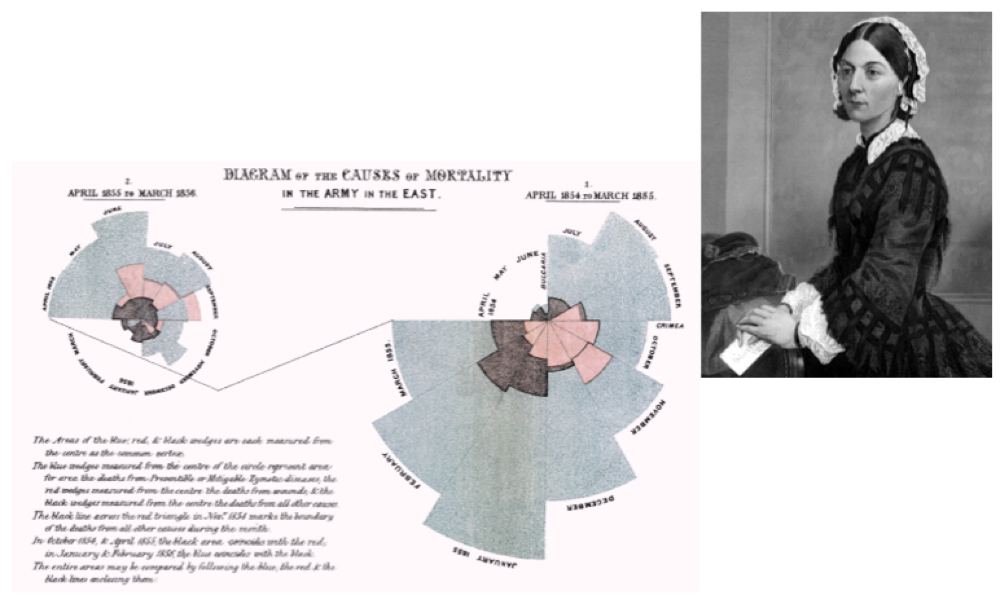
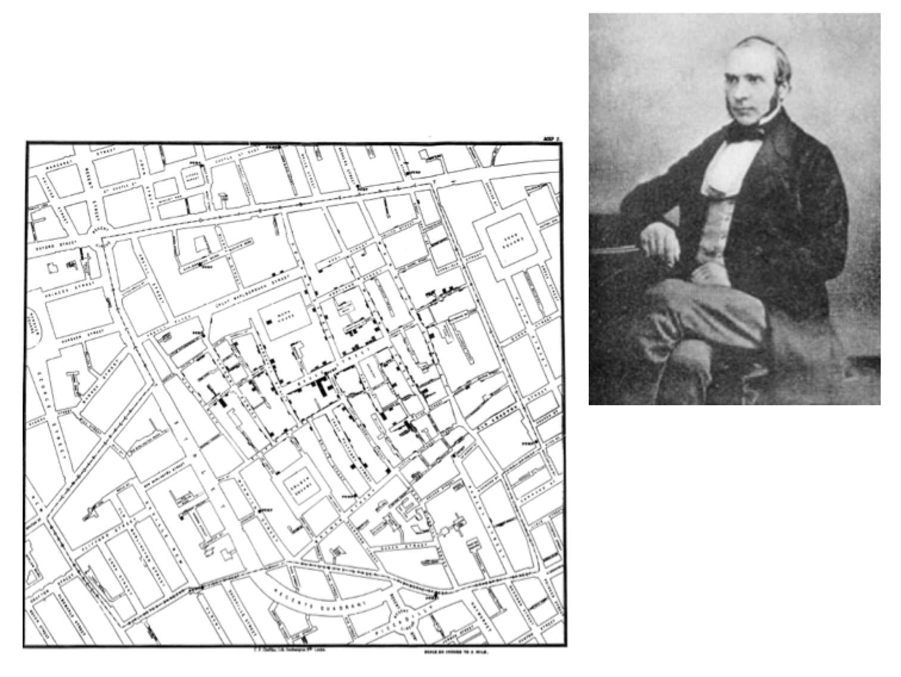
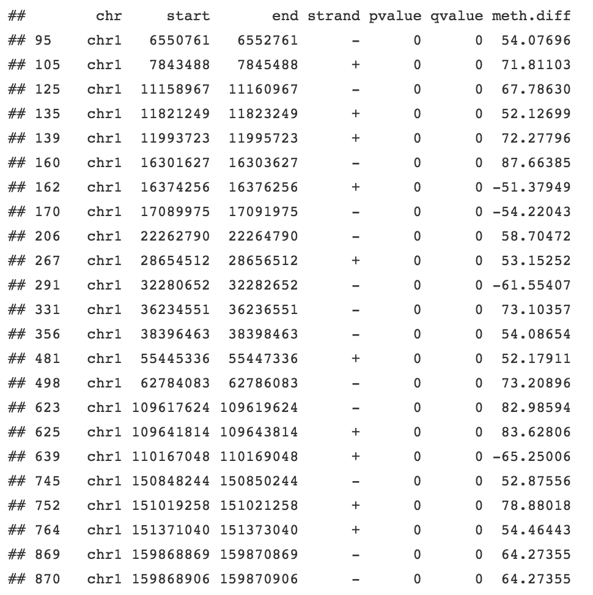
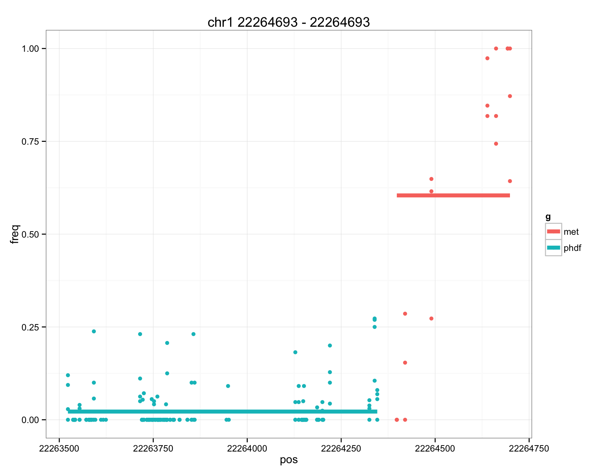
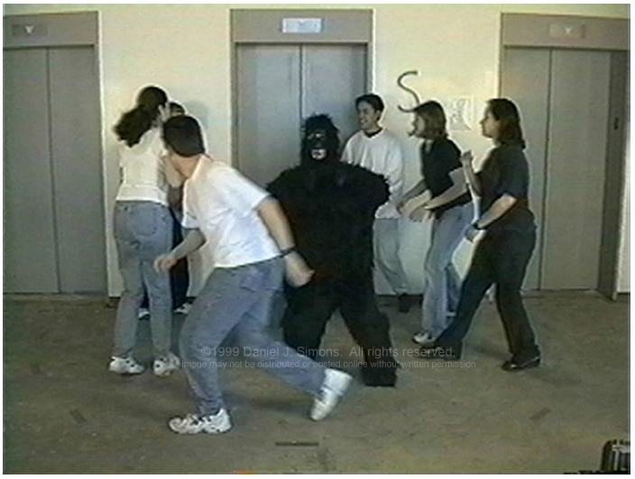
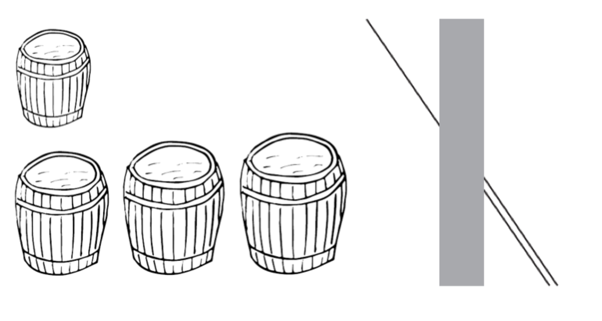
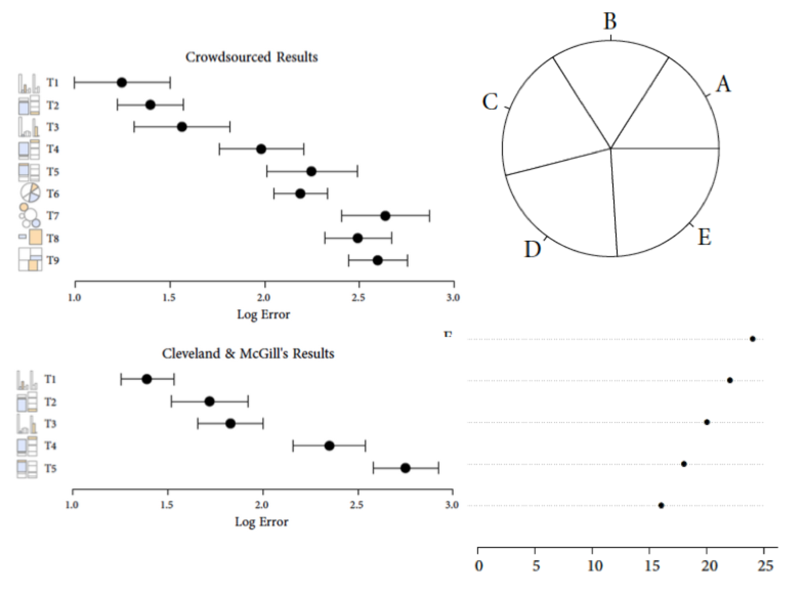
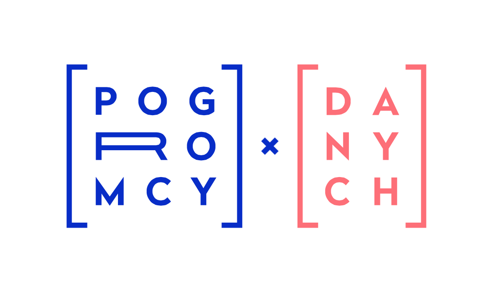

# Problemy Big Data

<table>
<tr><td>Syllogomania (zespół zbieractwa, patologiczne zbieractwo) – nabywanie lub trudności z pozbywaniem się rzeczy nieużytecznych bądź o małej dla innych osób wartości. 

Najczęstsze powody zbieractwa:

* obawa przed pozbyciem się czegoś użytecznego,
* poczucie bezpieczeństwa zbudowane na posiadaniu różnych przedmiotów,
* stosunek emocjonalny do posiadanych rzeczy.

</td>
<td></td></tr>
</table>

# Wojna Krymska, Florence Nightingale

<center></center>

# Na tropach cholery, John Snow

<center></center>

# Na tropach cholery, John Snow [gdyby znał program R]

<center></center>

# Seriale a baza IMDB

<br/>

<center><iframe frameBorder="0" width="900" height="600" src="http://beta.icm.edu.pl/IMDB2"></iframe></center>

# Wizualizacja pomaga zrozumieć biznes

<br/>

```{r, results='asis', comment=NA, echo=FALSE, message=FALSE}
#library(knitr)
#setwd("~/Dropbox/_Prezentacje_I_Szkolenia_/2015_BigData_Tech_Summit/")
#require(rCharts)
#load("mmGrupy3.rda")
#p1 <- nPlot(value ~ daty, group = "variable", data = mmGrupy3, type = "multiBarChart")
#p1$chart(stacked = TRUE)
#p1$save('mychart2.html', standalone = TRUE)
```

<center><iframe frameBorder="0" width="900" height="600" src="https://rawgithub.com/pbiecek/SmarterPoland_blog/master/2015/2015_BigData_Tech_Summit/mychart2.html"></iframe></center>

# Pomaga zrozumieć problem

<br/>

<center></center>

# Pomaga zrozumieć problem

<br/>

<center></center>


# Lub przyglądać się imprezom sportowym - Mecze

<center></center>

# Lub przyglądać się imprezom sportowym - Olimpiada

<center></center>

# Lub przyglądać się imprezom sportowym - Olimpiada

<center></center>

# Lub przyglądać się imprezom sportowym - Olimpiada

<center></center>

# Lub przyglądać się imprezom sportowym - Olimpiada

<center></center>

# To co widzimy nie zawsze jest tym co jest pokazane

<center></center>

Selective attention test  http://www.youtube.com/watch?v=vJG698U2Mvo

# Pułapki percepcji obrazu

<br/>

<center></center>

# Precyzja prezentacji

<br/>

<center></center>

# Znaj historię, którą chcesz pokazać

<br/>

<center></center>

# Znaj historię, którą chcesz pokazać

<br/>

<center></center>

# Zła wizualizacja wypacza historię

<br/>

<center></center>

# Zła wizualizacja wypacza historię

<br/><br/>

<center></center>

# Zła wizualizacja wypacza historię

<br/>

<center></center>

# Zła wizualizacja wypacza historię

<br/>

<center></center>


# Co dalej - FlowingData [http://flowingdata.com/]

<br/>

<center></center>

# Co dalej - Information is Beautiful [http://www.informationisbeautiful.net/]

<center></center>

# Co dalej - Charts and Things [http://chartsnthings.tumblr.com/]

<center></center>

#  Co dalej - Tabelau

<center><iframe frameBorder="0" width="900" height="600" src="https://public.tableausoftware.com/profile/nick.bignell#!/vizhome/IsabelsWeatherHomeworkblog/IsabelsWeatherHomework"></iframe></center>

# Co dalej - SmarterPoland [http://smarterpoland.pl/]

<br/>

<center></center>

# Eseje o wizualizacji danych [http://biecek.pl/Eseje/]

<center></center>

# pogRomcy danych - MOOC o R, wizualizacji i modelowaniu danych

<center></center>


# Co dalej 

* Shiny / ggvis / R http://shiny.rstudio.com/
* D3 i pochodne biblioteki http://d3js.org/
* Kibana http://www.elasticsearch.org/overview/kibana/
* Tableau http://www.tableau.com/
* IBM Many Eyes http://www-969.ibm.com/
* coraz więcej innych bibliotek...
